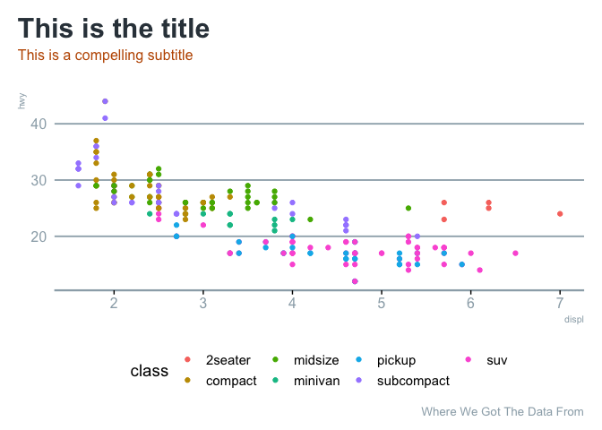

<!-- README.md is generated from README.Rmd. Please edit that file -->

# {mrworthingtonR}

<!-- badges: start -->

[](https://github.com/mrworthington/mrworthingtonR/actions/workflows/R-CMD-check.yaml)
[](https://app.codecov.io/gh/mrworthington/mrworthingtonR?branch=main)
[](https://app.netlify.com/sites/mrworthingtonr/deploys)
<!-- badges: end -->

The goal of {mrworthingtonR} is to make coding quicker + more efficient.

## Installation

You can install the development version of `{mrworthingtonR}` from
[Github](https://github.com/mrworthington/mrworthingtonR) with:

``` r
devtools::install_github("mrworthington/mrworthingtonR")
```

## Example

This is a basic example which shows you how to solve a common problem:

``` r
library(mrworthingtonR)
library(ggplot2)

ggplot(mpg) +
  aes(x = displ, y = hwy, colour = class) +
  geom_point() +
  theme_mrw(legend_position = "bottom") +
  labs(title = "This is the title",
       subtitle = "This is a compelling subtitle",
       caption = "Where We Got The Data From")
```


